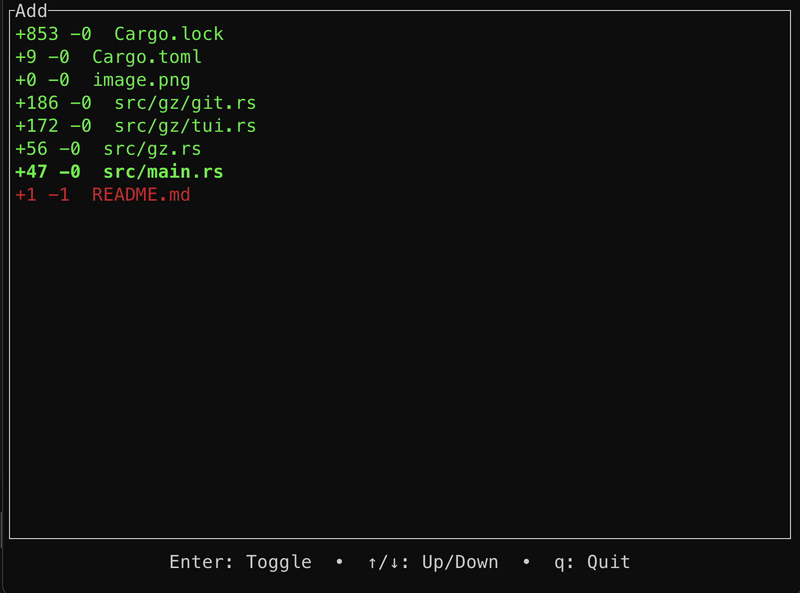

# gz

`gz` is a CLI tool that makes certain `git` operations more convenient.

> [!IMPORTANT]
> `gz` is not a `git` replacement, it only replaces certain operations.
> <br /> `gz` assumes you have `git` in your `PATH` to work.

## Installation

1. Clone the repository
    ```shell
    git clone git@github.com:ErenKarakas1/gz.git
    cd gz
    ```

2. Install the executable to your path through `cargo`
    ```shell
    cargo build
    cargo install --path .
    ```

## `gz` commands

| `gz` | `git` |
| ----- | ----- |
| `gz sync` | `git pull --ff-only origin <current-branch>` |
| `gz sync -f` | `git fetch origin <current-branch>` <br /> `git reset --hard origin/<current-branch>` |
| `gz stash` | `git stash push --include-untracked` |
| `gz uncommit [N]` | `git reset HEAD~[N] (default: 1)` |
| `gz branch <name>` | `git switch --create <name>` |
| `gz done` | `git switch main` <br /> `git branch --delete --force <switched-branch-name>` <br /> `git pull --ff-only origin main` |
| `gz add` | [Screenshot below](#gz-add) |

### gz add

